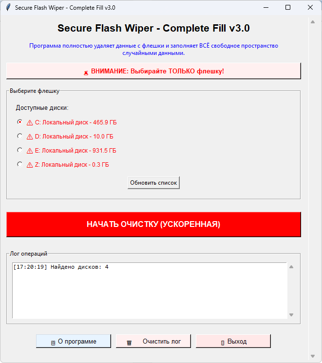

# Secure Wiper

**Secure Flash Wiper** — это программа для полного безопасного удаления данных с флеш-накопителей и других дисков. Она сочетает удаление файлов и ускоренное полное заполнение диска случайными данными, что делает восстановление информации невозможным даже с помощью профессиональных программ восстановления.

---

## Основные преимущества:

- Полное удаление: сначала удаляются все файлы, включая скрытые, системные и защищённые.
- Ускоренное заполнение: диск заполняется случайными данными в 3–5 раз быстрее, чем обычные методы.
- Полное заполнение свободного места: создаются файлы-заполнители до 0 байт свободного пространства.
- Адаптивные файлы: размеры файлов подбираются автоматически в зависимости от оставшегося места.
- Кэширование блоков данных: повторно используется один блок случайных данных для ускорения записи.
- Подробное логирование: весь процесс фиксируется с временными метками.
- Экстренное заполнение остатка: даже крошечные остатки свободного места заполняются отдельными файлами.

---

## Особенность

После очистки на флешке остаются временные файлы в папке _TRASH_FILL_, которые можно:

- Удалить вручную (если флешка сразу используется)
- Оставить как доказательство очистки (если флешка откладывается на хранение)

---

## Важные заметки

- Бесплатное ПО "как есть"
- Автор не несёт ответственности за потерю данных
- Всегда делайте бэкап важных файлов
- Тестируйте на ненужной флешке первый раз

---

## Для связи
- Телеграм: https://t.me/avhelpnew
- Почта: artemsoft@yahoo.com
- Новые версии: https://github.com/artemsoft2025

---

