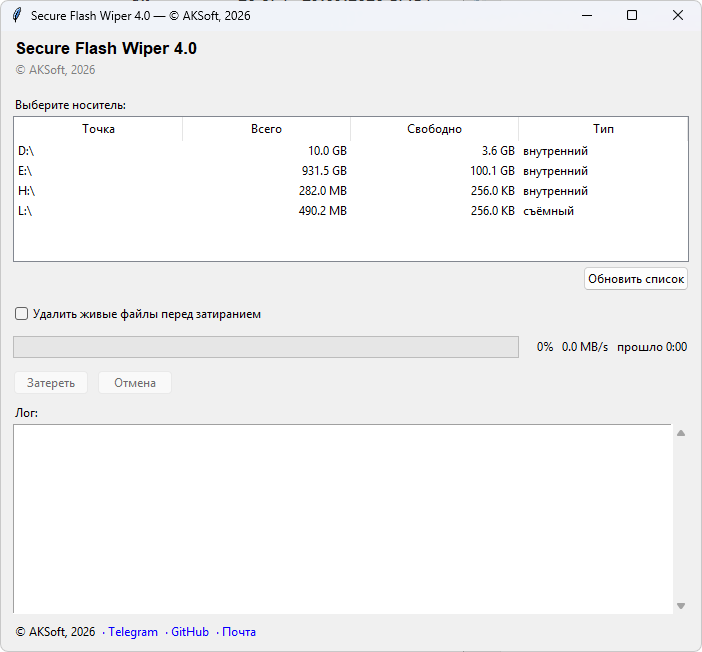
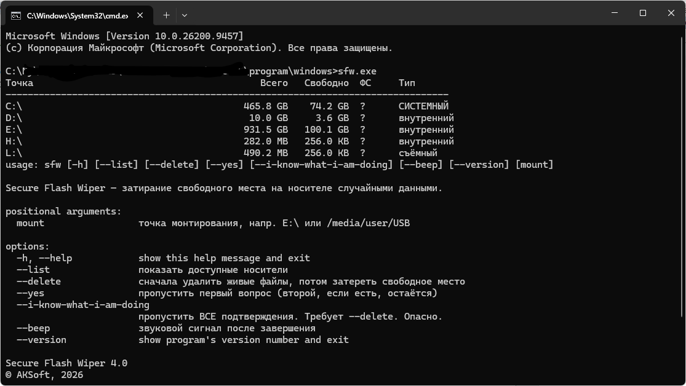

# Secure Flash Wiper 4.0

---

## ЧТО ЭТО

Secure Flash Wiper — утилита для безопасного затирания свободного места
на флешках и других носителях.

Программа записывает случайные данные в свободное пространство носителя
и оставляет их в папке `TRASH_FILL`. Это делает восстановление ранее
удалённых файлов невозможным обычными программами восстановления.

Особенность программы: мусор НЕ удаляется после работы. Пользователь
визуально видит, что свободное место действительно забито случайными
данными, а не просто "программа сказала, что всё готово".





## КАК ЭТО РАБОТАЕТ

1. Программа определяет всё свободное место на выбранном носителе.
2. Записывает туда случайные данные файлами не более 3 ГБ каждый
   (чтобы работало на FAT32, где лимит на файл — 4 ГБ).
3. Оставляет мусорные файлы в папке TRASH_FILL.
4. Остаётся служебный зазор 256 КБ, чтобы файловая система
   не потеряла работоспособность.
5. Сохраняет отчёт локально на компьютере.

После этого:
- Живые файлы (вне TRASH_FILL) — не тронуты (если не указан --delete).
- Ранее удалённые файлы — перезаписаны, восстановить нельзя.
- Мусор в TRASH_FILL — визуальное доказательство работы программы.
- Папку TRASH_FILL можно удалить вручную, когда убедитесь.
  Или оставить — если флешка отправляется на хранение, чтобы потом
  вспомнить, что очистка проводилась.

## БЕЗОПАСНОСТЬ

Программа ОТКАЗЫВАЕТСЯ работать с активным системным диском
(обычно `C:\` на Windows, `/` на Linux). Это главный запрет.
Затирание системного диска ломает работающую ОС и может
привести к потере загрузки.

Программа также ОТКАЗЫВАЕТСЯ работать с путями, которые не
являются точками монтирования (например, `/tmp`, `/home`, обычные
папки в корне). Это защита от случайного забивания мусором
данных системного раздела.

Для всех остальных дисков — предупреждение, но работа разрешена.
Это ваше право — затирать D:\, E:\ или любой другой диск.

## РЕЖИМЫ РАБОТЫ

1. По умолчанию:
   Забивает только свободное место. Живые файлы не трогает.

2. С параметром `--delete`:
   Сначала удаляет все живые файлы с носителя, потом забивает
   всё свободное место. Требует двух подтверждений.

## КОМАНДНАЯ СТРОКА (sfw.exe / sfw)

```
  sfw --list                     показать доступные носители
  sfw <диск>                     забить свободное место
  sfw <диск> --delete            удалить живые файлы, потом забить
  sfw <диск> --yes               пропустить первый вопрос
  sfw <диск> --beep              звуковой сигнал по завершении
  sfw --version                  версия и контакты
  sfw --help                     справка
```

  Дополнительно:
```
  sfw <диск> --delete --yes
      Пропустить первый вопрос (второй, строгий, остаётся).

  sfw <диск> --delete --i-know-what-i-am-doing
      Пропустить ВСЕ подтверждения. Требует --delete.
      ОПАСНО: ни один вопрос не задаётся.
```

ПРИМЕРЫ
```
  sfw E:\
  sfw E:\ --delete
  sfw E:\ --delete --yes
  sfw --list
```

## КАК ПРОВЕРИТЬ, ЧТО МУСОР ЗАПИСАН

После работы программы:

1. Откройте папку `TRASH_FILL` на носителе. Там лежат файлы
   `wipe_NNNN_*.bin`, занимающие всё свободное место.
2. Откройте любой файл в hex-редакторе — увидите случайные байты.
   Не нули, не паттерн — именно случайные данные.
3. В отчёте (локально) посмотрите поле "entropy" — она должна быть
   близка к 7.99. Это подтверждает, что данные действительно случайны.
4. Если хотите — проверьте SHA-256 любого файла из TRASH_FILL
   и сравните с хешем в отчёте. Должно совпасть.

## ИЗВЕСТНЫЕ ОГРАНИЧЕНИЯ

- Программа не работает с активным системным диском (`C:\` или `/`).
- Программа не работает с путями, которые не являются точками
  монтирования.
- На SSD/флешках с FTL часть старых данных может остаться в резервных
  блоках (см. "ЧТО ГАРАНТИРУЕТСЯ И ЧТО НЕТ").
- Скрытые разделы и системные области не затрагиваются.
- Отчёт на самой флешке не создаётся — только локально на компьютере.

## ЛИЦЕНЗИЯ

MIT License. Copyright (c) 2026 AKSoft.

Программа распространяется свободно, "как есть", без гарантий.
Можно использовать, копировать, изменять, распространять — при условии
сохранения уведомления об авторских правах.

## ВОПРОСЫ И ПОДДЕРЖКА

Телеграм:     https://t.me/avhelpnew
Почта:        artemsoft@yahoo.com
Новые версии: https://github.com/artemsoft2025


